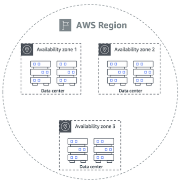

# Section 1: What is Cloud Computing?

# Traditional IT Overview - IT Terms

*Network:* cables, routers, and servers connected with each other

******Router******: networking device that forwards data packets between computer networks

- They know where to send your packets on the internet

******Switch******: takes a packet and sends it to the correct server/client on your network

# Problems with Traditional IT Approach

- Pay for the rent for the data center
- Pay for power supplies, cooling, and maintenance
- Adding and replacing hardware takes time
- Scaling is limited
- Hire a 24/7 team to deal with/monitor infrastructure

****The Cloud is the solution!****

# What is Cloud Computing?

Cloud computing is the on-demand delivery of computing power, database storage, applications, and other IT resources

Through a cloud services platform, you use a pay-as-you-go pricing model

- only paying for the requested resources as you use it

You can provision exactly the right type and size of computing resources you need

You can access as many resources as you need, almost instantly

# The Deployment Models of the Cloud

1. ******************************Private Cloud****************************** (ex. Rackspace)**:**
    1. Cloud services used by a single organization; not exposed to the public
    2. Complete control
    3. Security for sensitive applications
    4. Meet specific business needs
2. **********************Public Cloud********************** (ex. Azure, GCP, AWS)**:**
    1. Cloud resources owned and operated by a 3rd-party cloud service provider delivered over the internet
    2. 6 advantages of Cloud Computing:
        1. Trade capital expense (CAPEX) for operational expense (OPEX)
            1. Pay on-demand: no owning hardware
            2. Reduced Total Cost of Ownership (TCO) and OPEX
        2. Benefit from massive economies of scale
            1. Prices are reduced as AWS is more efficient due to large scale
        3. Stop guessing capacity
            1. Scale based on actual measured usage
        4. Increased speed and agility
        5. Stop spending money running and maintaining datacenters
        6. Go global in minutes: leverage the AWS global infrastructure
3. ************************Hybrid Cloud************************
    1. Keep some servers on-premise and extend some capabilities to the Cloud
    2. Control over sensitive assets in your private infrastructure
    3. Flexibility and cost-effectiveness of the public cloud

# The 5 Characteristics of Cloud Computing

1. **Completely on-demand self-service**:
    1. Users can provision resources and use them without interacting with the service provider
2. **Broad network access**:
    1. Resources are available over the network, and can be accessed by diverse client platforms
3. **********************************************Multi-tenancy and resource pooling**********************************************:
    1. Multiple customers can share the same infrastructure and applications with security and privacy
    2. Multiple customers are serviced from the same physical resources
4. **************************************************Rapid elasticity and scalability:**************************************************
    1. Automatically and quickly acquire/dispose of resources when necessary
    2. Quickly and easily scale based on-demand
5. ****************Measured service****************:
    1. Usage is measured, and users pay correctly for what they have used

# Problems Solved by the Cloud

1. **********************Flexibility**********************: change resources and/or resource types when needed
2. **********Cost-effectiveness**********: pay as you go, for what you use
3. **********************Scalability**********************: accommodate larger loads by making hardware stronger or adding additional nodes
4. ****Elasticity****: the ability to scale in and out when needed
5. **********************************************************High-Availability (HA) and Fault-Tolerance**********************************************************: build across datacenters
6. **************Agility**************: rapidly develop, test, and launch software applications

# Types of Cloud Computing

1. ************Infrastructure as a Service (IaaS)************:
    1. Provides building blocks for cloud IT
    2. Provides networking, computers, and data storage space
    3. Highest level of flexibility
    4. Easy parallel with traditional on-premise IT
    5. Examples include:
        1. Amazon EC2 (on AWS)
        2. GCP, Azure, Rackspace, Digital Ocean, Linode
2. **********************************Platform as a Service (PaaS)**********************************:
    1. Removes the need for your organization to manage the underlying infrastructure
    2. Focus on the deployment and management of your applications
    3. Examples include:
        1. Elastic Beanstalk (on AWS)
        2. Heroku, Google App Engine (GCP), Azure
3. ********************************************************Software as a Service (SaaS)********************************************************:
    1. A completed product that is run and managed by the service provider
    2. Examples include:
        1. Many AWS services (ex. Rekognition for Machine Learning)
        2. Gmail, Dropbox, Zoom

# Pricing of the Cloud - Quick Overview

AWS has 3 pricing fundamentals, following the pay-as-you-go pricing model:

1. **Compute**:
    1. pay for computing time
2. **************Storage**************:
    1. pay for data stored in the cloud
3. **************Data transfer ***OUT*** of the cloud**
    1. data transfer in the cloud is free

These 3 pricing fundamentals solve the expense issue of traditional IT

# AWS Cloud Overview - AWS Cloud Use Cases

AWS applies to a diverse set of industries

Use cases include:

- Enterprise IT, Backup & Storage, Big Data Analytics
- Website hosting, Mobile & Social applications
- Gaming servers

# AWS Global Infrastructure

Includes AWS Regions, Availability Zones, Datacenters, and Edge Locations (Points of Presence)

# AWS Regions

A region is a cluster of data centers

Names can be *********us-east-1*********, *********eu-west-3*********, etc.

Most AWS services are region-scoped

# How to choose an AWS Region?

**********************Compliance********************** with data governance and legal requirements: data never leaves a region without your explicit permission

******************Proximity****************** to customers: reduced latency (little to no lag)

************************************Available services************************************ with a Region: new services and features aren’t available in every Region

**************Pricing**************: Pricing varies from region to region and is transparent on the service pricing page

# AWS Availability Zones

Availability zones are what goes inside an AWS region

Each region has many AZs (usually 3, the minimum is 2, and the maximum is 6)

Each AZ is one or more discrete data centers with redundant power, networking, and connectivity

They’re separate from each other so that they’re isolated from disasters

They’re connected with high bandwidth and ultra-low latency

# AWS Points of Presence (Edge Locations)

Amazon has 216 Points of Presence (205 Edge Locations and 11 Regional Caches) in 84 cities across 42 countries

Content is delivered to end users with lower latency

# Tour of the AWS Console

**********Global Services:**********

- Identity and Access Management (IAM)
- Route 53 (DNS service)
- CloudFront (Content Delivery Network)
- WAF (Web Application Firewall)

Most AWS services are **************************region-scoped**************************:

- Amazon EC2 (IaaS)
- Elastic Beanstalk (PaaS)
- Lambda (Function as a Service (FaaS))
- Rekognition (SaaS)