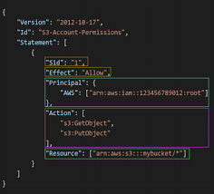
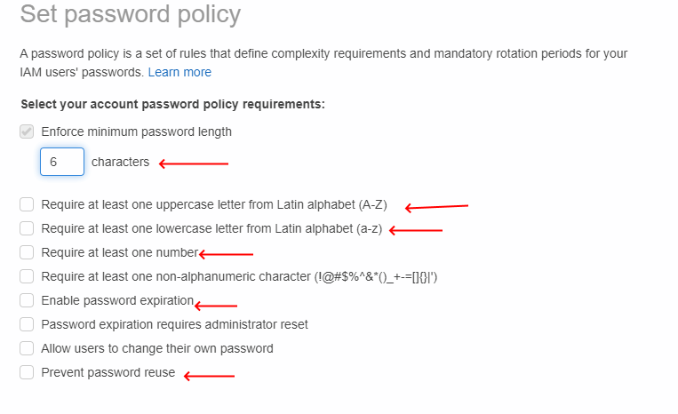

# Section 2: IAM: Identity and Access Management

# IAM: Users and Groups

- IAM is a global service
- ********Root******** account is created by default and shouldn’t be used or shared
- **********Users********** are people within the organization and can be grouped
- Groups only contain users and not other groups
- Users don’t have to belong to a group (not best practice), and they can also belong to multiple groups

# IAM Permissions

- Users and groups can be assigned JSON documents called ****************policies****************
- These policies define the permissions of the user(s)
- In AWS, you apply the **************************************************least privilege principle**************************************************: don’t give more permissions than a user needs

# IAM Policies Structure

Consists of:

- **Version**: policy language version, always include “2012-10-17” (required)
- **Id**: an identifier for the policy (optional)
- ******************Statement******************: one or more individual statements (required)

Statements consist of:

- ******Sid******: an identifier for the statement (optional)
- ************Effect************: whether the statement allows or denies (Allow, Deny)
- ******************Principal******************: account/user/role to which this policy is applied to
- ************Action************: list of actions this policy allows or denies
- ****************Resource****************: list of resources to which the action is applied to
- ******************Condition******************: conditions for when this policy is in effect (optional)

# IAM: Password Policy

Strong passwords —> higher security for your account(s)

In AWS, you can set a password policy:

- Set a minimum password length
- Require specific character types:
    - Uppercase
    - Lowercase
    - Numbers
    - Special characters
- Allow all IAM users to change their own password
- Require users to change their password after some time (expiration)
- Prevent password re-use

# Multi-Factor Authentication (MFA)

- Users have access to your account and can possibly change configurations or delete resources in your AWS account
- You want to protect your Root Accounts and IAM users
- The main benefit of MFA: if a password is stolen or hacked, the account isn’t compromised

# MFA Device Options in AWS

1. **Virtual MFA device**:
    1. Google Authenticator (phone only)
    2. Authy (multi-device)
2. ************************************************Universal 2nd Factor (U2F) Security Key************************************************
    1. Yubikey
        1. Support for multiple root and IAM users with a single security key
3. ******************************************************Hardware Key Fob MFA Device******************************************************
4. ************************Hardware Key Fob MFA Device for AWS GovCloud (US)************************

# How can users access AWS?

- To access AWS, you have 3 options:
    1. AWS Management Console (protected by password and MFA)
    2. AWS Command Line Interface (CLI): protected by access keys
    3. AWS Software Developer Kit (SDK): for code, protected by access keys
- Access keys are generated through the AWS console
- Users manage their own access keys:
    - ****************************Access Key ID**************************** —> username
    - ************************************Secret Access Key************************************ —> password
    

# What is the AWS CLI?

- A tool that enables you to interact with AWS services using commands in your command-line shell
- Provides direct access to the public APIs of AWS services
- It’s open-source and you can develop scripts to manage your resources
- It’s an alternative to the AWS Management Console

# What is the AWS SDK?

- AWS Software Development Kit
- Language-specific APIs (set of libraries)
- Enables you to access and manage AWS services programmatically
- Embedded into your applications and supports:
    - SDKs (JavaScript, Python, PHP, .NET, etc.)
    - Mobile SDKs (Android, iOS, etc.)
    - IoT Device SDKs (Embedded C, Arduino)

# AWS CLI - Hands On

Never use the root account for creating security credentials, only IAM users

Access keys cannot be recovered and can only be downloaded upon creation

Commands:

- *************aws configure************* —> for configuring the CLI
    - sets the Access Key ID and Secret Access Key, region name
- *******************aws iam list-users******************* —> displays all users in your account

# AWS CloudShell

Simply an alternative to using the CLI

# IAM Roles for AWS Services

Some AWS services will need to perform actions on your behalf

For this reason, we assign permissions to AWS services with IAM Roles

- IAM Roles will act like a user, but it’s intended to be used with AWS services, and not physical users

Common roles include:

- EC2 Instance Roles
- Lambda Function Roles
- Roles for CloudFormation

# IAM Security Tools

**IAM Credentials Report** (account level)

- a report that lists all of your account’s users and the status of their various credentials

**IAM Access Advisor** (user-level)

- Access Advisor shows the service permissions granted to a user and when those services were last accessed
- This information can be used to revise your policies

# IAM Guidelines and Best Practices

- Don’t use the root account except for the AWS account setup
- One physical user = One AWS user
- Assign users to groups and assign permissions to groups
- Create a strong password policy
- Use and enforce the use of Multi-Factor Authentication (MFA)
- Create and use Roles for giving permissions to AWS services
- Use Access keys for programmatic access (CLI/SDK)
- Audit permissions of your account with the IAM Credentials Report
- Never share IAM users and Access Keys

# Shared Responsibility Model for IAM

| AWS is responsible for: | You are responsible for: |
| --- | --- |
| Infrastructure (global network security) | Users, Groups, Roles, Policy management, and monitoring |
| Configuration and vulnerability analysis | Enable MFA on all accounts |
| Compliance Validation | Rotate all of your keys often |
|  | Use IAM tools to apply appropriate permissions |
|  | Analyze access patterns and review permissions |