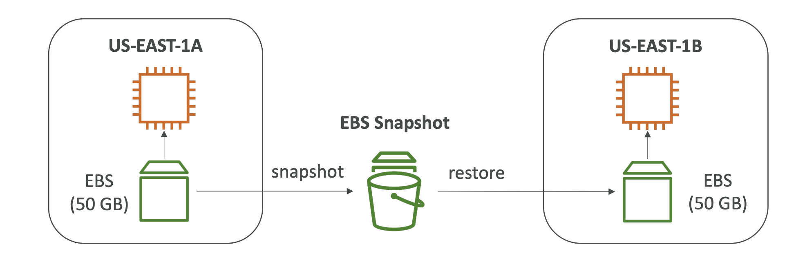
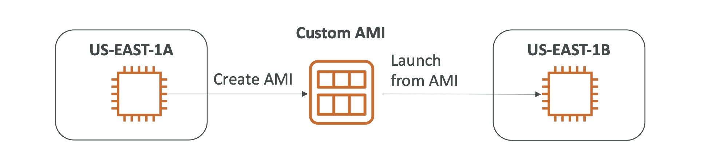
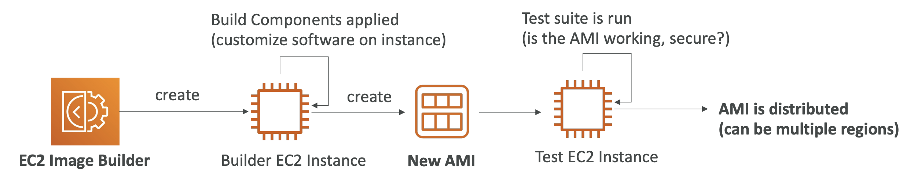

# Section 4: EC2 Instance Storage

# What is an EBS Volume?

Most importantly; an EBS (Elastic Block Store) Volume is a network drive you can attach to your instances when you run

It allows your instances to persist data, even after their termination

They can only be mounted to one instance at a time (at the Certified Cloud Practitioner level)

- Associate Level —> “multi-attach” feature for some EBS

They are bound to a specific AZ

Think of them as a “network USB stick”

Free tier: 30 GB of free EBS storage of type General Purpose (SSD) or Magnetic per month

# EBS Volume

It’s a network drive (i.e. not a physical drive)

- it uses the network to communicate to the instance, which means there might be a bit of latency

It’s locked to an Availability Zone (AZ)

- an EBS volume in us-east-1a cannot be attached to us-east-1b
- to move a volume across AZs, you first need to snapshot it

Have a provisioned capacity (size in GBs, and IOPS)

- you get billed for all the provisioned capacity
- you can increase the capacity of the drive over time

# EBS - Delete on Termination Attribute

Controls the EBS behavior when an EC2 instance is terminated

- by default, the root EBS volume is deleted alongside the terminated instance
- by default, any other attached EBS volume is not deleted (attribute disabled)

This can be controlled by the AWS console/AWS CLI

**Use case:** preserve root volume when an instance is terminated

# EBS Snapshots

Make a backup (snapshot) of your EBS volume at a point in time

It’s not necessary to detach the volume to make a snapshot, but it’s recommended just to make sure everything is “clean” on the EBS volume

Can copy snapshots across AZ or Regions

- you will be able to transfer some of your data in a different region of AWS to leverage the global infrastructure

# EBS Snapshot Features

1. EBS Snapshot Archive:
    - Move a snapshot to an “archive tier” that is 75% cheaper
    - Takes 24-72 hours to restore from the archive
2. Recycle Bin for EBS Snapshots:
    - Setup rules to retain deleted snapshots so you can recover them after an accidental deletion
    - Specify retention (1 day - 1 year)

Copying snapshots across/within regions can come in handy when planning a DR strategy where your data is backed up in another region of aWS

Volumes can also be made from EBS snapshots

# AMI Overview

**AMI:** Amazon Machine Image

AMI is a customization of an EC2 instance

- you add your own software, configurations, operating system, monitoring, etc.
- By creating our own AMI, we have a faster boot/config. time because all your software is pre-packaged

AMI are built for a specific region (and can be copied across regions)

You can launch EC2 instances from:

- a public AMI: AWS provided
- your own AMI: you make and maintain them yourself
- an AWS marketplace AMI: an AMI someone else made (and potentially sells)

# AMI Process (from an EC2 instance)

1. Start an EC2 instance and customize it
2. Stop the instance (for data integrity)
3. Build an AMI — this will also create EBS snapshots
4. Launch instances from other AMIs

# EC2 Image Builder

Used to automate the creation of Virtual Machines or container images

- automate the creation of EC2 AMIs; maintain, validate, and test

Can be run on a schedule (whenever packages are updated, weekly, etc.)

Free service (only paying for underlying resources)

# EC2 Instance Store

EBS volumes are network drives with good but “limited” performance

If you need a high-performance hardware disk, use the EC2 Instance Store

EC2 instances are VMs, but attached to real hardware servers

- EC2 Instance Store is the hardware and hard drive that’s attached to the physical server

******************Use cases******************:

- Better I/O performance
    - EC2 Instance store loses their storage if stopped (aka. “ephemeral storage”
    - not good for long-term storage
- Good for buffer, cache, scratch data, temporary content
- Risk of data loss if hardware fails
- Backups and Replication are your responsibility

********************************************************************************************************************************************************************************************************************************Anytime you see very high performance, hardware-attached volume for EC2 instances —> Local EC2 Instance Store********************************************************************************************************************************************************************************************************************************

# EFS - Elastic File System

Managed NFS (network file system) that can be mounted on 100s of EC2

EFS *****only***** works with Linux EC2 instances in multi-AZ

Highly available, scalable, expensive (3x gp2), pay per use, no capacity planning

# EFS Infrequent Access (EFS-IA)

Storage class that is cost-optimized for files not accessed every day

Up to 92% lower cost compared to EFS Standard

EFS will automatically move your files to EFS-IA based on the last time they were accessed

Enabled EFS-IA with a lifecycle policy

- ex: move files that haven’t been accessed for 60 days to EFS-IA

Transparent to the applications accessing EFS

# Shared Responsibility Model for EC2 Storage

| AWS is responsible for: | You are responsible for: |
| --- | --- |
| Infrastructure | Setting up backup/snapshot procedures |
| Replication of data for EBS volumes and EFS drives | Setting up data encryption |
| Replacing faulty hardware | Responsible for any data on the drives |
| Ensuring their employees cannot access your data | Understanding the risk of using EC2 Instance Store |

# Amazon FSx Overview

Managed service used to launch 3rd-party high-performance file systems on AWS

There are currently 3:

1. FSx for Lustre*
2. FSx for Windows File Server*
3. FSx for NetApp ONTAP

# Amazon FSx for Windows File Server

A fully managed, highly reliable, and scalable Windows native shared file system

Built on Windows File Server

Supports SMB protocol and Windows NTFS

Integrated with MS Active Directory

Can be accessed directly from AWS or your on-premise infrastructure

# Amazon FSx for Lustre

A fully managed, high-performance, scalable file storage for High-Performance Computing (HPC)

The name “Lustre” is derived from “Linux” and “cluster”

******************Use cases******************:

- Machine Learning
- Analytics
- Video Processing
- Financial Modeling

Scales up to 100s GB/s, millions of IOPS, sub-ms latencies