# Section 7: Databases

# Databases Intro

- Storing data on disk (EFS, EBS, EC2 Instance Store, S3) can have its limits
- In a database:
    - You can ******************structure****************** the data
    - You build **************indexes************** to efficiently query / search through data
    - You define ****************************relationships**************************** between your ****************datasets****************

- Databases are optimized for a purpose and come with different features, shapes, and constraints

# Relational Databases

- Looks like Excel spreadsheets, with links between them
- Can use the SQL language to perform queries/lookups

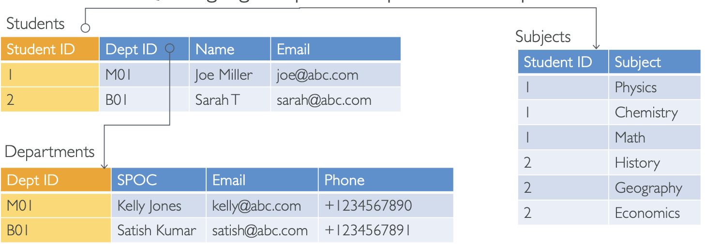

# NoSQL Databases

- NoSQL = non-SQL = non-relational databases
- NoSQL databases are purpose-built for specific data models and have flexible schemas for building modern applications
- Benefits:
    - Flexibility: easy to evolve data model
    - Scalability: designed to scale out by using distributed clusters
    - High-performance: optimized for a specific data model
    - Highly functional: type optimized for the data model
- Examples: Key-value, document, graph, in-memory, search databases

# NoSQL data example: JSON

- JSON = JavaScript Object Notation
- JSON is a common form of data that fits into a NoSQL model
- Data can be ************nested************
- Fields can ********************change******************** over time
- Support for new types: arrays, etc.

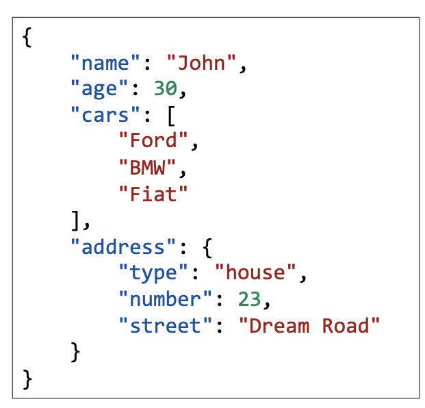

# Databases & Shared Responsibility on AWS

- AWS offers to manage different databases
- Benefits include:
    - Quick Provisioning, High Availability, Vertical and Horizontal Scaling
    - Automated Backup & Restore, Operations, Upgrades
    - Operating System Patching is handled by AWS
    - Monitoring, alerting

************Note:************ many database technologies could be run on EC2, but you must handle the resiliency yourself, backup, patching, high availability, fault tolerance, scaling…

# AWS RDS Overview

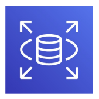

AWS RDS

- RDS stands for **************************Relational Database Service**************************
- It’s a managed DB service for DBs and uses SQL as a query language
- It allows you to create databases in the cloud that are managed by AWS
    - Postgres
    - MySQL
    - MariaDB
    - Oracle
    - Microsoft SQL Server
    - Aurora (AWS Proprietary database)

# Advantages of using RDS vs. deploying DB on EC2

- RDS is a managed service:
    - Automated provisioning, OS patching
    - Continuous backups and restore to specific timestamps (Point in Time Restore)
    - Monitoring dashboards
    - Read replicas for improved read performance
    - Multi-AZ setup for DR (Disaster Recovery)
    - Maintenance windows for upgrades
    - Scaling capability (vertical and horizontal)
    - Storage backed by EBS (gp2 or io1)
- BUT you can’t SSH into your instances

# RDS Solution Architecture

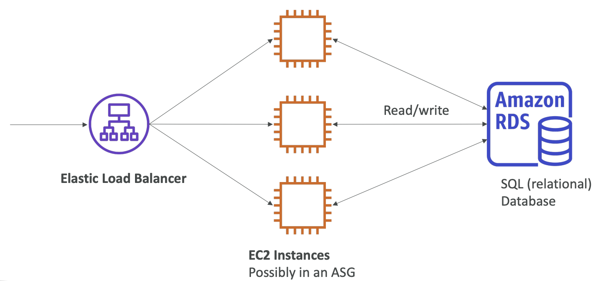

# Amazon Aurora

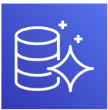

Amazon Aurora

- Aurora is a proprietary technology from AWS (not open-sourced)
- PostgreSQL and MySQL are both supported as Aurora DB
- Aurora is “AWS cloud-optimized” and claims 5x performance improvement over MySQL on RDS, over 3x the performance of Postgres on RDS
- Aurora storage automatically grows in increments of 10 GB, up to 128 TB
- Aurora costs more than RDS (20% more) - but is more efficient
- Not available in the free tier

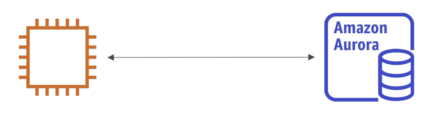

# RDS Deployments: Read Replicas, Multi-AZ

| Read Replicas: | Multi-AZ: |
| --- | --- |
| Scale the read workload of your DB  | Failover in case of AZ outage (high availability) |
| Can create up to 15 Read Replicas | Data is only read/written to the main database |
| Data is only written to the main DB | Can only have 1 other AZ as failover |

Read Replicas

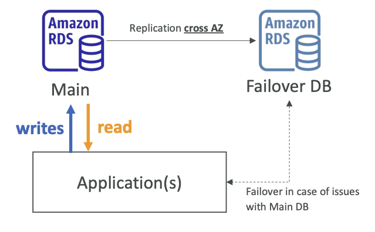

Multi-AZ

# RDS Deployments: Multi-Region

- Multi-Region (Read Replicas)
    - Disaster recovery in case of a regional issue
    - Local performance for global reads
    - Replication cost

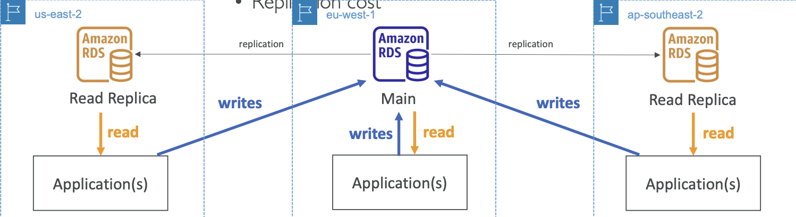

# Amazon ElastiCache Overview

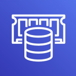

- In the same way, RDS is to get managed Relational Databases…
- ElastiCache is to get managed Redis and Memcached
- Caches are in-memory databases with high performance, low latency
- Helps reduce the load off databases for read-intensive workloads
- AWS takes care of OS maintenance/patching, optimizations, setup, configuration, monitoring, failure recovery, and backups

# ElastiCache Solution Architecture - Cache

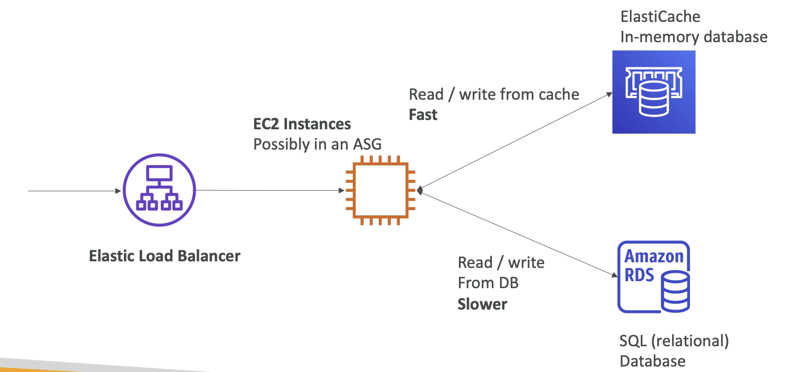

# DynamoDB

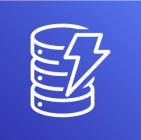

- Fully Managed Highly available with replication across 3 AZ
- NoSQL database - not a relational database
- Scales to massive workloads, distributed “serverless” database
- Millions of requests per second, trillions of rows, 100s of TB of storage
- Fast and consistent in performance
- Single-digit millisecond latency — low latency retrieval
- Integrated with IAM for security, authorization, and administration
- Low-cost and auto-scaling capabilities
- Standard & Infrequent Access (IA) Table Class

# DynamoDB - type of data

- DynamoDB is a key/value database
    
    [What Is a Key-Value Database?](https://aws.amazon.com/nosql/key-value/)
    

# DynamoDB Accelerator - DAX

- Fully Managed in-memory cache for DynamoDB
- 10x performance improvement - single-digit millisecond latency to microseconds latency - when accessing your DynamoDB tables
- Secure, highly scalable & highly available
- Difference with ElastiCache at the CCP level: DAX is only used for and is integrated with DynamoDB, while ElastiCache can be used for other databases

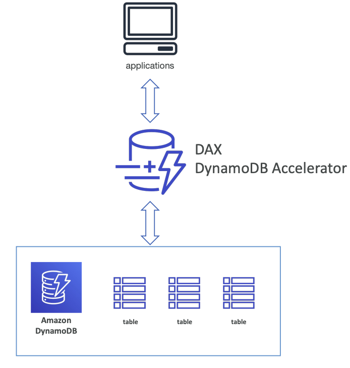

# DynamoDB - Global Tables

- Make a DynamoDB table accessible with low latency in multiple regions
- Active-Active replication (read/write to any AWS Region)

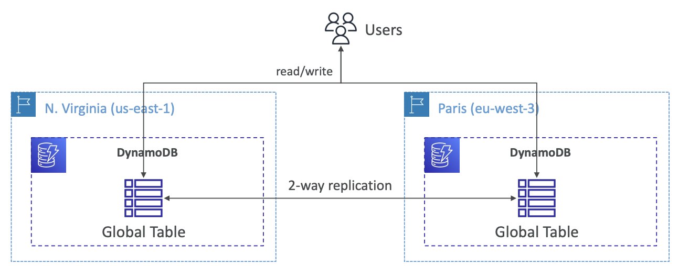

# Redshift Overview

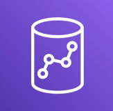

- Redshift is based on PostgreSQL, but it’s not used for OLTP
- It’s OLAP - online analytical processing (analytics and data warehousing)
- Load data once every hour, not every second
- 10x better performance than other data warehouses, scale to PBs of data
- Columnar storage of data (instead of row-based)
- Massively Parallel Query Execution (MPP), highly available
- Pay as you go based on the instances provisioned
- Has a SQL interface for performing the queries
- BI tools such as AWS Quicksight or Tableau integrate with it

# Amazon EMR

- EMR stands for “Elastic MapReduce”
- EMR helps create Hadoop clusters (Big Data) to analyze and process vast amounts of data
- The clusters can be made of hundreds of EC2 instances
- Also supports Apache Spark, HBase, Presto, Flink
- EMR takes care of all the provisioning and configuration
- Auto-scaling and integrated with Spot instances
- ****************************************************************************************************************************************Use cases: data processing, machine learning, web indexing, big data****************************************************************************************************************************************

# Amazon Athena

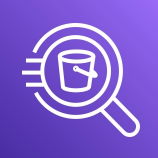

- Serverless query service to analyze data stored in Amazon S3
- Uses standard SQL language to query the files
- Supports CSV, JSON, ORC, Avro, and Parquet (built on Presto)

- Pricing: $5 per TB of data scanned

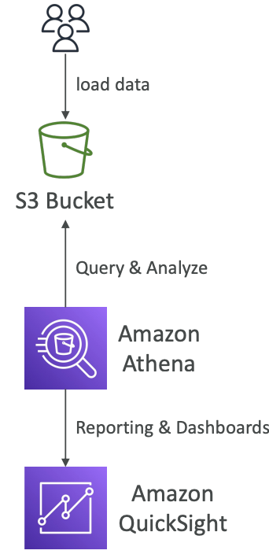

- Use compressed or columnar data for cost-savings (less scan)
- ********************************************************************************************************************Use cases:********************************************************************************************************************
    - Business intelligence ****************************************************************************************************************************************************************************************************************************************
    - Analytics ****************************************************************************************************************************************************************************************************************************************
    - Reporting ****************************************************************************************************************************************************************************************************************************************
    - Analyze & query VPC Flow Logs
    - ELB Logs ****************************************************************************************************************************************************************************************************************************************
    - CloudTrail trails, etc.
- **************Exam Tip:************** analyze data in S3 using serverless SQL, use Athena

# Amazon QuickSight

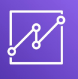

- Serverless machine learning-powered business intelligence service to create interactive dashboards
- Fast, automatically scalable, embeddable, with per-session pricing
- Use cases:
    - Business Analytics
    - Building visualizations
    - Perform ad-hoc analysis
    - Get business insights using data
- Integrated with RDS, Aurora, Athena, Redshift, S3

# DocumentDB

- Aurora is an “AWS implementation” of PostgreSQL/MySQL
- DocumentDB is the same for MongoDB (which is a NoSQL database)
- MongoDB is used to store, query, and index JSON data
- Similar “deployment concepts” as Aurora
- Fully Managed, highly available with replication across 3 AZ
- DocumentDB storage automatically grows in increments of 10GB, up to 64TB
- Automatically scales to workloads with millions of requests per second

# Amazon Neptune

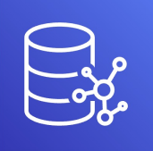

- Fully-managed graph database
- A popular graph dataset would be a social network
    - Users have friends
    - Posts have comments
    - Comments have likes from users
    - Users share and like posts
- Highly available across 3 AZ, with up to 15 read replicas
- Build and run applications working with highly connected datasets — optimized for these complex and hard queries
- Can store up to billions of relations and query the graph with milliseconds latency
- Highly available with replications across multiple AZs
- Great for knowledge graphs (Wikipedia), fraud detection, recommendation engines, social networking

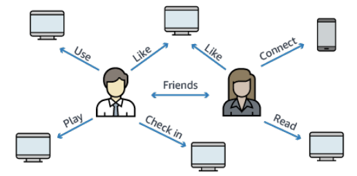

# Amazon QLDB

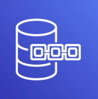

- QLDB stands for “Quantum Ledge Database”
- A ledger is a book **recording financial transactions**
- Fully Managed, Serverless, Highly available, Replication across 3 AZ
- Used to ********************************************************************************************************************************review the history of all the changes made to your application data******************************************************************************************************************************** over time
- ********************Immutable******************** system: no entry can be removed or modified, cryptographically verifiable

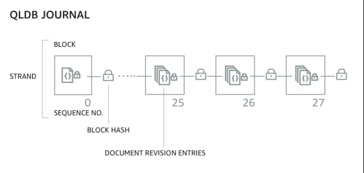

- 2-3x better performance than common ledger blockchain frameworks, manipulate data using SQL
- Difference with Amazon Managed Blockchain: **********************************************************no decentralization component**********************************************************, in accordance with financial regulation rules

# Amazon Managed Blockchain

- Blockchain makes it possible to build applications where multiple parties can execute transactions **************************************************************************************************without the need for a trusted, central authority**************************************************************************************************
- Amazon Managed Blockchain is a managed service to:
    - Join public blockchain networks
    - Or create your own scalable private network
- Compatible with the frameworks Hyperledger Fabric & Ethereum

# AWS Glue

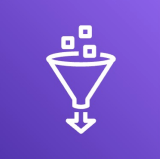

- Managed **********************************************************extract, transform, and load********************************************************** (ETL) service
- Useful to prepare and transform data for analytics
- Fully ************************serverless************************ service

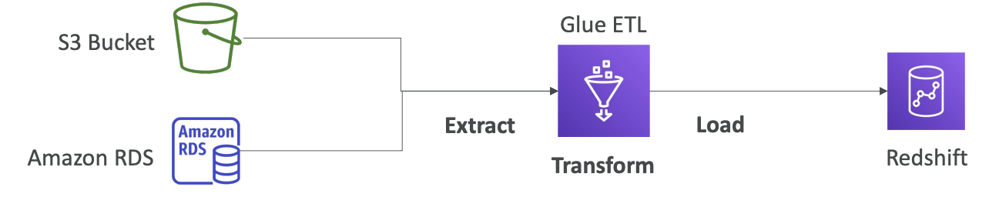

- Glue Data Catalog: catalog of datasets
    - can be used by Athena, Redshift, EMR

# DMS - Database Migration Service

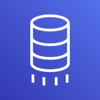

- Quickly and securely migrate databases to AWS, resilient, self-healing

- The source database remains available during the migration

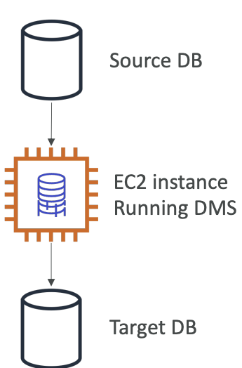

- Supports:
    - Homogenous migrations: Oracle to Oracle
    - Heterogenous migrations: Microsoft SQL Server to Aurora
    
    # Databases & Analytics Summary in AWS
    
- Relational Databases - OLTP: RDS & Aurora (SQL)
- Differences between Multi-AZ, Read Replicas, Multi-Region
- In-memory Database: ElastiCache
- Key/Value Database: DynamoDB (serverless) & DAX (cache for DynamoDB)
- Warehouse - OLAP: Redshift (SQL)
- Hadoop Cluster: EMR
- Athena: query data on Amazon S3 (serverless & SQL)
- QuickSight: dashboards on your data (serverless)
- DocumentDB: “Aurora for MongoDB” (JSON - NoSQL database)
- Amazon QLDB: Financial Transactions Ledger (immutable journal, cryptographically verifiable)
- Amazon Managed Blockchain: managed Hyperledger Fabric & Ethereum blockchains
- Glue: Managed ETL (Extract Transform Load) and Data Catalog service
- Database Migration: DMS
- Neptune: graph database